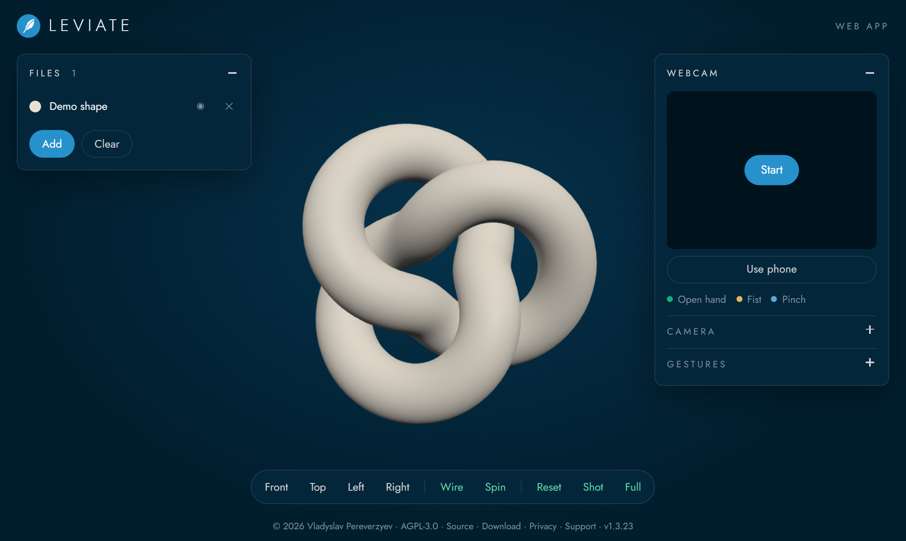
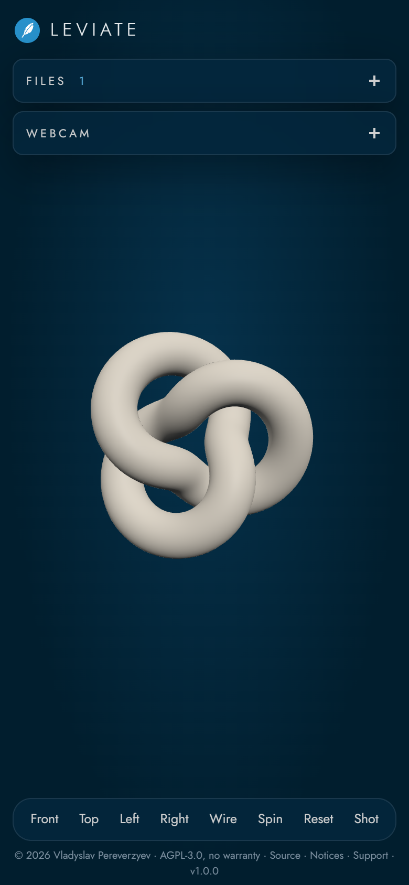
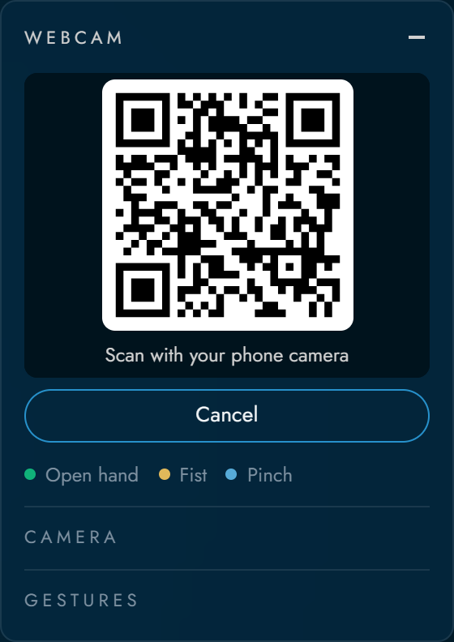
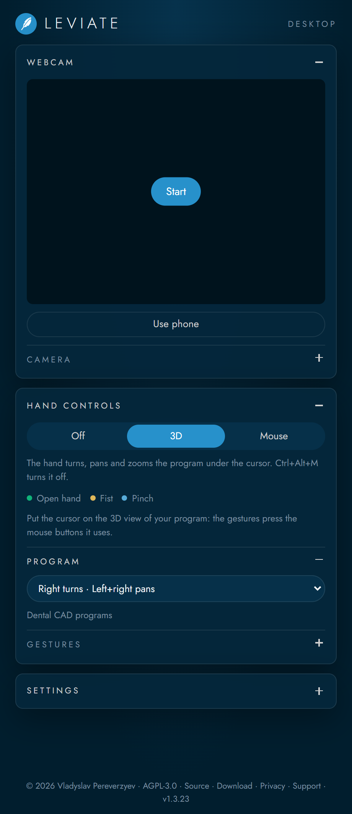

# Leviate

[](https://github.com/vladpereverzyev/leviate/actions/workflows/build.yml)
[](https://github.com/vladpereverzyev/leviate/releases)
[](https://github.com/vladpereverzyev/leviate/releases)
[](LICENSE)

[](https://github.com/vladpereverzyev/leviate/blob/main/README.md)
[](https://github.com/vladpereverzyev/leviate/blob/main/README.it.md)
[](https://github.com/vladpereverzyev/leviate/blob/main/README.es.md)
[](https://github.com/vladpereverzyev/leviate/blob/main/README.fr.md)
[](https://github.com/vladpereverzyev/leviate/blob/main/README.de.md)

**Jetzt ausprobieren: <https://vladpereverzyev.github.io/leviate/>**

**Download für Windows, macOS, Linux und Blender: <https://vladpereverzyev.github.io/leviate/download.html>**

Bewege 3D-Scans mit bloßen Händen. Leviate ist eine Web-App, die jede Webcam, am
Computer oder am Handy, in einen Handcontroller für 3D-Modelle verwandelt. Öffne einen
Scan, heb die Hand vor die Kamera und dreh, verschieb oder zoome ihn, ohne etwas zu
berühren.

Alles läuft im Browser auf der CPU. Keine Installation, kein Server, keine GPU nötig
und deine Dateien verlassen nie dein Gerät.



## Funktionen

- **Handgesten**: offene Hand zum Drehen, Faust zum Verschieben, Daumen und Zeigefinger
  zum Zoomen.
- **Jede Webcam**: eingebaute oder USB-Kameras am Computer, Front- oder Rückkamera am Handy.
- **Dein Handy als Webcam**: scanne einen QR-Code mit einem iPhone oder Android-Handy
  und seine Kamera streamt zum Computer. Keine App zu installieren.
- **Kameraausgabe nach Wahl**: Gerät, Auflösung (480p, 720p, 1080p), Bildrate, Front-
  oder Rückkamera und Spiegeln. Das Panel zeigt, was die Kamera wirklich liefert.
- **Viele 3D-Formate**: STL, PLY, OBJ, GLB, GLTF, 3MF, FBX, DAE, 3DS, AMF, VTK, PCD und XYZ.
- **Mehrere Scans gleichzeitig**: zusammen geladene Dateien behalten ihre
  Originalkoordinaten, so bleiben Ober- und Unterkiefer oder die Teile einer Baugruppe
  ausgerichtet.
- **Scans bleiben farbig**: PLY-Vertexfarben, PLY-Texturen, OBJ-Vertexfarben und OBJ
  mit MTL und Texturbildern.
- **Werkzeuge pro Objekt**: Farbe, ein- oder ausblenden, entfernen.
- **Schwebende Fenster**: Dateien und Webcam liegen in eigenen Fenstern, die du
  verschieben und einklappen kannst. Am Handy stapeln sie sich unter der Kopfzeile.
- **Ansichtswerkzeuge**: Vorder-, Drauf-, Links- und Rechtsansicht, Drahtgitter,
  Drehteller, Screenshot als PNG und Vollbild.
- **Um jeden Punkt drehen**: Mittelklick (oder Doppelklick, Doppeltippen am Handy) auf
  einen Punkt des Modells und jede Drehung läuft um ihn herum. **Reset** geht zurück
  zur Mitte.
- **Maus und Touch** funktionieren weiter neben den Gesten.
- **Blender**: das Add-on Leviate for Blender bringt dieselbe Handsteuerung in Blender,
  mit der Webcam oder dem Handy. Die Hand bewegt die Ansicht oder die ausgewählten Objekte.
- **Komplett offline**: alle Bibliotheken und das Handmodell liegen im Repository.

## Gesten


Die Zeichnungen zeigen die 21 Handpunkte, die die App verfolgt und über die
Webcam-Vorschau zeichnet, in denselben Farben wie für jede Geste.

| Handpose | Aktion |
| --- | --- |
| Offene Hand (vier oder fünf Finger gestreckt) | Beweg die Hand, um das Modell zu **drehen** |
| Faust | Beweg die Hand, um das Modell im Raum zu **verschieben** |
| Daumen und Zeigefinger gestreckt, andere Finger geschlossen | Spreiz die beiden Finger zum **Vergrößern** und schließ sie zum **Verkleinern** |

Der Zoom misst den Abstand zwischen Daumen und Zeigefinger im Verhältnis zur Größe der
Handfläche, deshalb zoomt es nicht von selbst, wenn die Hand näher an die Kamera kommt.
Beim Wechsel von einer Pose zur anderen springt das Modell nicht, weil jede Geste dort
beginnt, wo die vorige aufgehört hat.

Die Empfindlichkeit jeder Geste und die Glättung lassen sich im Bereich **Gestures**
des Panels einstellen. Die Einstellungen bleiben im Browser gespeichert.

## Schnellstart

Öffne **<https://vladpereverzyev.github.io/leviate/>** in Chrome, Edge, Safari oder
Firefox, lade eine oder mehrere 3D-Dateien und drück **Start** im Webcam-Fenster. Das
ist alles: keine Installation, kein Konto. Nach dem ersten Besuch ist alles, was die
App braucht, bereits im Browser.

### Am Handy

<table>
<tr>
<td width="220"></td>
<td valign="middle">

Öffne denselben Link am Handy und alles funktioniert auch dort:

- **Dateien**: wähle Scans aus der Dateien-App, iCloud Drive oder Google Drive.
- **Gesten**: die Frontkamera beobachtet deine Hand, während du auf den Bildschirm schaust.
- **Fenster**: Files und Webcam stapeln sich unter der Kopfzeile und öffnen sich
  einzeln. Tippe auf einen Titel, um es zu öffnen oder zu schließen.
- **Touch**: mit einem Finger ziehen zum Drehen, mit zwei Fingern zum Verschieben,
  Pinch zum Zoomen.
- **Werkzeugleiste**: Ansichten und Werkzeuge bleiben unten, nur ein Tippen entfernt.

Um das Handy nur als Kamera für einen Computer zu nutzen, siehe
[Dein Handy als Webcam](#dein-handy-als-webcam).

</td>
</tr>
</table>

### Eigene Kopie betreiben

Leviate ist eine statische Website, jeder Webserver kann sie also hosten. Browser laden
keine JavaScript-Module oder WebAssembly von `file://`, deshalb den Ordner über HTTP
ausliefern:

```sh
git clone https://github.com/vladpereverzyev/leviate.git
cd leviate
node scripts/build-web.mjs
python -m http.server 8000 --directory dist/web
```

Öffne dann die Adresse, die der Server ausgibt. Handys brauchen eine `https`-Adresse,
um die Kamera zu öffnen, deshalb veröffentliche deine Kopie auf einem HTTPS-Host wie
GitHub Pages, Netlify oder Cloudflare Pages.

## Dein Handy als Webcam

Jedes iPhone oder Android-Handy kann die Kamera von Leviate auf einem Computer sein.
Auf keinem der beiden Geräte muss etwas installiert werden.

<table>
<tr>
<td width="260"></td>
<td valign="middle">

1. Öffne am Computer das Fenster **Webcam** und drück **Use phone**.
   In der Vorschau erscheint ein QR-Code.
2. Scanne ihn mit der Handykamera. Leviate öffnet sich in Safari oder Chrome am Handy.
3. Tippe auf **Start camera** und erlaube die Kamera. Es startet mit der Frontkamera;
   **Flip** wechselt zur Rückkamera.
4. Das Handyvideo erscheint im Webcam-Fenster und die Gesten funktionieren wie mit
   einer normalen Webcam.

</td>
</tr>
</table>

Lass die Seite am Handy offen, solange du es nutzt. Drück **Disconnect phone** am
Computer, um die Sitzung zu beenden. **Stop** am Handy pausiert sie: der Computer zeigt
wieder denselben QR-Code und **Start camera** am Handy verbindet sich neu, ohne ihn noch
einmal zu scannen. Geht die Verbindung verloren und zeigt der Computer einen neuen Code,
liest ihn **Scan QR code** direkt auf der Handyseite. Ein Klick auf den QR-Code kopiert
den Kopplungslink, praktisch, wenn du ihn auf anderem Weg ans Handy schicken willst.

So funktioniert es: die beiden Geräte verbinden sich über WebRTC. Der kostenlose
[PeerJS](https://peerjs.com)-Server stellt sie nur einander vor und gibt die
Verbindungsdaten weiter; das Video geht direkt und verschlüsselt vom Handy zum
Computer. Wenn beide in Netzen sind, die eine direkte Verbindung blockieren, läuft das
Video über einen TURN-Server von PeerJS, weiterhin verschlüsselt. Der QR-Code zeigt
immer auf eine `https`-Seite, weil ein Handy die Kamera nur dort öffnet. Eine Kopie auf
deinem eigenen Computer koppelt über <https://vladpereverzyev.github.io/leviate/>.

## In Blender nutzen

**Leviate for Blender** bringt die Handsteuerung in Blender: Webcam und Handerkennung
laufen in Blender selbst, ohne Browser.

1. Lade das Zip für dein System aus dem [neuesten Release](https://github.com/vladpereverzyev/leviate/releases/latest):
   `leviate-blender-<version>-windows-x64.zip`, `-macos-arm64.zip` oder `-linux-x64.zip`.
   Zieh es in Blender 4.2 oder neuer.
2. Drück in der 3D-Ansicht **N** und öffne den Tab **Leviate**. Wähl **This computer**
   für die Webcam oder **Phone**, dann drück **Start camera**. Mit **Phone** erscheint ein
   QR-Code: scanne ihn und tippe auf dem Handy auf **Start camera**, ohne App.
3. Offene Hand dreht, Faust verschiebt, Pinch zoomt. **Move** wählt die Ansicht oder die
   ausgewählten Objekte.

In der Ecke der 3D-Ansicht erscheint eine kleine Kameravorschau mit den Handpunkten. Das
Video wird nie aufgenommen: die Webcam bleibt in Blender, das Handy schickt sein Video
direkt an Blender. Ausführliche Anleitung
in [integrations/blender](integrations/blender/).

## Leviate for Desktop

<table>
<tr>
<td width="220"></td>
<td valign="middle">

**Leviate for Desktop** bringt die Hand in jedes Programm des Computers, mit der Webcam oder dem
Handy (QR-Code, wie in der Web-App). Sie hat zwei Module:

- **3D**: die Gesten der Web-App in deinem 3D-Programm. Offene Hand dreht, Faust verschiebt,
  Pinch zoomt die Ansicht unter dem Cursor. Wähle, wie das Programm die Maus nutzt (zum
  Standard *Right turns · Left+right pans* wie in Dental-CAD-Programmen, oder zum Beispiel
  *Middle turns · Shift+middle pans* für Blender) oder lege die Tasten selbst fest.
- **Mouse**: die offene Hand bewegt den Cursor, ein kurz ruhig gehaltener Finger ist ein
  Linksklick, zwei Finger ein Rechtsklick.

</td>
</tr>
</table>


Download im [neuesten Release](https://github.com/vladpereverzyev/leviate/releases/latest): `leviate-<Version>-windows-x64.exe`,
`-macos-arm64.dmg` (Apple silicon), `-macos-x64.dmg` (Intel) oder `-linux-x64.AppImage`.
Vollständige Anleitung in [desktop](desktop/) (auf Englisch).

## Unterstützte Dateien

| Format | Farben | Hinweise |
| --- | --- | --- |
| STL | eine Farbe deiner Wahl | Normalen werden beim Laden neu berechnet |
| PLY | Vertexfarben oder Textur | für eine Textur das Bild zusammen mit dem PLY laden (`comment TextureFile` im Header); ein PLY ohne Flächen wird als Punktwolke gezeigt |
| OBJ | Vertexfarben oder MTL mit Texturen | die `.obj` zusammen mit ihrer `.mtl` und den Bildern laden |
| GLB, GLTF | eigene Materialien und Texturen | Draco- und meshoptimizer-Kompression unterstützt; für `.gltf` die `.bin` und die Bilder dazugeben |
| 3MF | eigene Farben | |
| FBX, DAE, 3DS | eigene Materialien und Texturen | die Texturbilder mit der Datei laden |
| AMF | eigene Farben | |
| VTK, VTP | Vertexfarben | |
| PCD, XYZ | Punktfarben | als Punktwolken gezeigt |

Wähle oder zieh alle Dateien eines Scans gleichzeitig hinein. Fehlt eine Textur oder
eine Begleitdatei, sagt dir die App, welche.

## So funktioniert es

1. **Kamera**: `getUserMedia` öffnet die gewählte Webcam mit der gewünschten Auflösung
   und Bildrate.
2. **Handerkennung**: [MediaPipe Hand Landmarker](https://ai.google.dev/edge/mediapipe/solutions/vision/hand_landmarker)
   läuft als WebAssembly mit dem CPU-Delegate (XNNPACK) und liefert für jedes neue Bild
   21 Punkte der Hand. Es läuft in einem Web Worker (`shared/js/hand-worker.js`), so wartet die
   3D-Ansicht nie darauf; Browser ohne Module Worker greifen auf den Hauptthread zurück.
3. **Pose**: `shared/js/gestures.js` vergleicht die Richtung jeder Fingerspitze mit der
   Richtung der Handfläche. So erkennt es die gestreckten Finger und macht daraus eine
   der drei Posen. Eine Pose muss einige Bilder lang stabil sein, bevor sie aktiv
   wird, das verhindert Flackern.
4. **Bewegung**: die Mitte der Handfläche wird geglättet und ihre Bewegung zwischen
   den Bildern wird zu Drehung oder Verschiebung. Für den Zoom wird das Verhältnis
   zwischen dem Abstand Daumen Zeigefinger und der Größe der Handfläche über die Zeit
   verfolgt.
5. **Rendering**: [three.js](https://threejs.org) zeichnet die Scans mit WebGL. Die
   Drehung folgt den Bildschirmachsen, deshalb dreht eine Handbewegung nach rechts das
   Modell immer nach rechts, egal in welcher Ansicht.

## Projektstruktur

| Pfad | Zweck |
| --- | --- |
| `web/` | Nur die Website: Seiten, Styles, die Web-App, three.js, Icons, Bilder, Sitemap |
| `web/index.html` | Layout: Szene, Objekte, Webcam, Gesten und Ansichtsbereiche |
| `web/css/style.css` | Styles für Desktop und Handy |
| `web/js/app.js` | Szene, Laden der Dateien, Kamera, Erkennungsschleife und Oberfläche |
| `web/js/windows.js` | Schwebende Fenster: ziehen, einklappen, Handy-Layout |
| `web/vendor/three/` | three.js, seine Loader und Decoder (MIT, Draco Apache-2.0) |
| `web/icons/`, `web/site.webmanifest` | App-Icons für Browser, iOS und Android |
| `web/img/` | Bilder der Website: Gestenzeichnungen, Screenshot, Bild für soziale Netzwerke |
| `shared/` | Was Website, Desktop-App und Blender teilen: Handerkennung, Gesten, Handy-Kopplung, MediaPipe, PeerJS, Schriften, Handmodell, Version |
| `shared/js/gestures.js` | Erkennung der Posen und Bewegung (ohne DOM, leicht zu testen) |
| `shared/js/version.js` | Aktuelle Version, in der App angezeigt |
| `shared/js/hand-worker.js` | Handerkennung in einem Web Worker, abseits des Hauptthreads |
| `shared/js/phone.js` | Handy als Webcam: QR-Kopplung am Computer, Kameraseite am Handy |
| `shared/vendor/peerjs/`, `shared/vendor/qrcode/` | WebRTC-Kopplung und QR-Code-Generator (MIT) |
| `shared/vendor/fonts/` | Schrift Jost (SIL OFL 1.1) |
| `shared/vendor/mediapipe/` | MediaPipe Tasks Vision und seine WebAssembly-Laufzeit (Apache-2.0) |
| `shared/models/hand_landmarker.task` | MediaPipe-Handmodell (Apache-2.0) |
| `desktop/` | Leviate for Desktop (Electron): die Hand in jedem Programm, Module 3D und Mouse |
| `integrations/` | Add-ons, die die Handsteuerung in andere Programme bringen (Blender) |
| `docs/` | Screenshots, QR-Fenster und Gestenzeichnungen für dieses README |
| `scripts/build-web.mjs` | Fügt `web/` und `shared/` in `dist/web/` zusammen, auf GitHub Pages veröffentlicht von `.github/workflows/pages.yml` |
| `scripts/bump.mjs` | Erhöht die Version (patch, minor oder major) |
| `scripts/build-blender.py` | Packt das Blender-Add-on als Zip |
| `scripts/build-desktop.mjs` | Baut die Desktop-App für Windows, macOS oder Linux |

## Versionen

Die Version steht in der App neben dem Namen und liegt in `shared/js/version.js`. Sie folgt
der [semantischen Versionierung](https://semver.org) und wächst mit jedem Commit: der
Pre-Commit-Hook in `.githooks/` erhöht die Patch-Nummer automatisch. Einmal nach dem
Klonen aktivieren:

```sh
git config core.hooksPath .githooks
```

Für ein Minor- oder Major-Release vor dem Commit `node scripts/bump.mjs minor` (oder
`major`) ausführen. Ein Tag `v<version>` startet den Workflow Build & Release: er baut
die Zips der Integrationen und veröffentlicht sie als neues Release auf der
[Release-Seite](https://github.com/vladpereverzyev/leviate/releases). Die Web-App ist nicht
im Release, sie läuft immer über den Link oben.

## Kein Medizinprodukt

Leviate ist ein 3D-Betrachter. Es ist kein Medizinprodukt und nicht für Diagnose,
Behandlungsplanung oder andere klinische Entscheidungen gedacht. Prüfe Scans immer in
der dafür zugelassenen Software.

## Datenschutz

Der Videostream und deine Scans werden nur in deinem Browser verarbeitet. Nichts wird
hochgeladen, kein Tracking und kein Konto. Der einzige externe Dienst ist der
PeerJS-Broker für **Use phone**, der die Verbindungsdaten sieht, aber nie das Video.

## Mitwirken

Issues und Pull Requests sind willkommen. Lies vorher [CONTRIBUTING.md](CONTRIBUTING.md)
und den [Verhaltenskodex](CODE_OF_CONDUCT.md). Jeder Beitrag braucht das
[Contributor License Agreement](CLA.md): der CLA-Assistant-Bot bittet dich, es mit
einem Kommentar in deinem ersten Pull Request zu unterschreiben.

### Bring Leviate in dein CAD

Integrationen für andere CAD- und 3D-Programme sind der willkommenste Beitrag: FreeCAD,
Rhino, Fusion, SolidWorks, Inventor, SketchUp, Dental-CAD mit offener API und jedes
Programm mit Skripting. Blender zeigt den Weg. Die Regeln für Integrationen:

1. Ein Ordner pro Programm in `integrations/<programm>/` mit Quellcode, README und LICENSE.
2. Überall dieselben Gesten: die Handerkennung von Leviate for Blender wiederverwenden
   (`gestures.py` und das MediaPipe-Modell), siehe [integrations/README.md](integrations/README.md).
3. Nur lokal: die Kamera wird auf dem Computer gelesen, nichts wird aufgenommen oder verschickt, kein Tracking.
4. Schlank: Skripting und Add-on-System des Programms nutzen, keine zusätzlichen
   Installationen.
5. Lizenz: die, die das Programm verlangt (Blender-Add-ons sind GPL-3.0-or-later),
   sonst AGPL-3.0. Das CLA gilt.
6. Name: "Leviate for <Programm>", nicht vom Hersteller des Programms gemacht oder
   unterstützt.
7. Der Workflow Build & Release baut jede Integration als Zip und hängt sie an das Release.

## Unterstützung

Wenn dir Leviate nützt, kannst du die Entwicklung über
[GitHub Sponsors](https://github.com/sponsors/vladpereverzyev) oder
[Ko-fi](https://ko-fi.com/vladpereverzyev) unterstützen.

## Lizenz

Copyright (C) 2026 Vladyslav Pereverzyev

Leviate steht unter einer doppelten Lizenz.

- **Open Source**: [GNU Affero General Public License v3.0](LICENSE). Du darfst es
  kostenlos nutzen, untersuchen, ändern und teilen. Wenn du eine geänderte Version
  verbreitest oder sie anderen über ein Netzwerk anbietest, musst du deinen Quellcode
  unter derselben Lizenz veröffentlichen.
- **Kommerziell**: wenn du Leviate ohne die Pflichten der AGPL in ein
  Closed-Source-Produkt oder einen Dienst einbauen willst, gibt es eine kommerzielle Lizenz. Öffne
  ein Issue mit dem Titel "Commercial license" oder kontaktiere
  [@vladpereverzyev](https://github.com/vladpereverzyev) auf GitHub.

Der Name "Leviate" und sein Logo fallen nicht unter die AGPL-3.0 und dürfen ohne
Erlaubnis nicht für geänderte Versionen verwendet werden.

Die Integrationen in `integrations/` haben eine eigene Lizenzdatei. Leviate for Blender
steht unter GPL-3.0-or-later, wie Blender es für seine Add-ons verlangt.

Komponenten von Drittanbietern behalten ihre eigenen Lizenzen. Siehe [NOTICE](NOTICE)
und [THIRD-PARTY-NOTICES.md](THIRD-PARTY-NOTICES.md).
