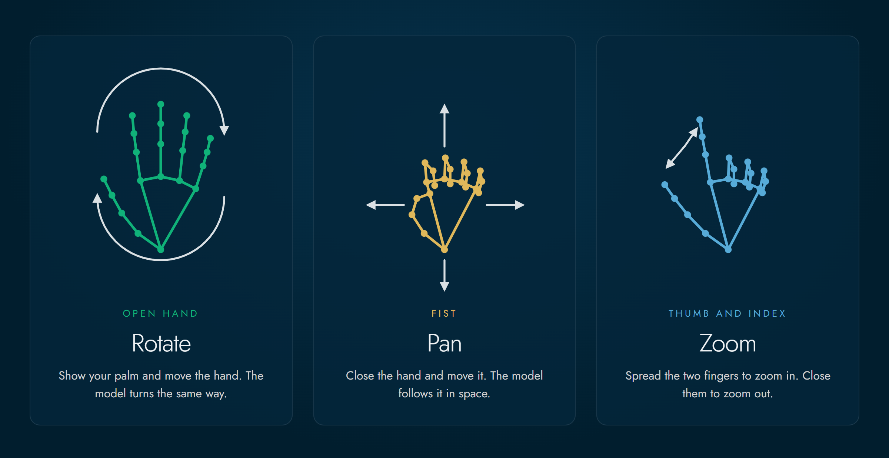

# Leviate

Muovi i modelli 3D e il mouse a mano nuda. Alza la mano davanti alla webcam, o al tuo
telefono, e ruota, sposta e ingrandisci una scansione 3D senza toccare niente: utile quando
hai le mani occupate, con i guanti o non pulite. La mano viene riconosciuta sul tuo
dispositivo e il video non viene mai registrato né inviato.

**Provalo subito nel browser: <https://vladpereverzyev.github.io/leviate/>**

## Installa

| Dove | Come |
| --- | --- |
| **Browser** (computer o telefono) | Niente da installare: apri <https://vladpereverzyev.github.io/leviate/> |
| **Windows** | `leviate-<version>-windows-x64.exe` dall'[ultima release](https://github.com/vladpereverzyev/leviate/releases/latest) |
| **macOS** (firmato e notarizzato) | `-macos-arm64.dmg` (Apple silicon) o `-macos-x64.dmg` (Intel) dall'[ultima release](https://github.com/vladpereverzyev/leviate/releases/latest) |
| **Ubuntu** e Linux con snap | [Snap Store](https://snapcraft.io/leviate): `sudo snap install leviate` |
| **Linux** | `-linux-x64.AppImage` o `-linux-x64.flatpak` dall'[ultima release](https://github.com/vladpereverzyev/leviate/releases/latest) |
| **Chrome**, Edge | [Chrome Web Store](https://chromewebstore.google.com/detail/leviate/moipdbapejodmhhmhhngbcehcgngchlh) |
| **Blender** 4.2 o successivo | [Blender Extensions](https://extensions.blender.org/add-ons/leviate/), oppure in Blender **Get Extensions** cerca Leviate |
| **Dentra Viewer** | il pannello **Plugin** del Viewer, vedi [integrations/dentra](integrations/dentra/) |

Tutti i download, con una guida per ogni sistema: <https://vladpereverzyev.github.io/leviate/download.html>

## Gesti

| Posa della mano | Vista 3D | Mouse (Leviate for Desktop e Chrome) |
| --- | --- | --- |
| Mano aperta | **ruota** | **muove** il cursore |
| Pugno | **sposta** |  |
| Pollice e indice | apri per **ingrandire**, chiudi per **rimpicciolire** |  |
| Un dito fermo |  | **clic sinistro**, tienilo fermo per il **doppio clic** |
| Due dita ferme |  | **clic destro** |

Funziona anche con i guanti, nitrile e lattice di ogni colore. **Ctrl+Alt+M** (Ctrl+Option+M su macOS) spegne e riaccende la mano da qualsiasi programma in Leviate for Desktop.

## Cosa contiene

- **App web**: apre STL, PLY, OBJ, GLB, GLTF, 3MF, FBX e altri, più scansioni insieme e a colori, su computer o telefono. [Guida](docs/guide.md) (in inglese)
- **Il telefono come webcam**: inquadra un codice QR, nessuna app da installare. [Come funziona](docs/guide.md#use-your-phone-as-a-webcam)
- **Leviate for Desktop**: la mano su qualsiasi programma, con un modulo **3D** per il tuo programma 3D o CAD e un modulo **Mouse**. [Guida](desktop/)
- **Leviate for Chrome**: le modalità 3D e Mouse dentro le pagine del browser. [Guida](integrations/chrome-extension/)
- **Leviate for Blender**: la vista o gli oggetti selezionati seguono la tua mano. [Guida](integrations/blender/)
- **Leviate for Dentra Viewer**: ruota, sposta e ingrandisce i modelli del Viewer. [Guida](integrations/dentra/)

Come è fatto, come avviare una tua copia e come compilarlo: [docs/development.md](docs/development.md) (in inglese).

## Non è un dispositivo medico

Leviate è un visualizzatore 3D. Non è un dispositivo medico e non serve per diagnosi,
pianificazione dei trattamenti o qualsiasi altra decisione clinica. Controlla sempre
le scansioni nel software approvato per quello scopo.

## Privacy

Il flusso video e le tue scansioni vengono elaborati solo dentro il browser. Non viene
caricato niente, nessun tracciamento e nessun account. Gli unici servizi esterni sono quelli di
**Use phone** (il broker PeerJS e un server STUN di Google), che vedono i dati di
connessione ma mai il video. Leviate for Chrome e il plugin per Dentra tengono il video sul
computer allo stesso modo. Tutti i dettagli nella [privacy policy](https://vladpereverzyev.github.io/leviate/privacy.html).

## Uso dell'IA

Parti di Leviate, del suo codice, della documentazione e dei pacchetti per gli store (tra cui i
file Linux in `desktop/packaging/linux/`: la voce desktop, il metainfo AppStream e il manifest Flatpak, e la ricetta dello snap in `snap/`)
sono state scritte con l'aiuto di strumenti di intelligenza artificiale generativa. Ogni parte è
stata rivista, provata ed è mantenuta dall'autore, che ne è responsabile.

## Contribuire

Issue e pull request sono benvenute. Leggi prima [CONTRIBUTING.md](CONTRIBUTING.md)
e il [Codice di condotta](CODE_OF_CONDUCT.md). Ogni contributo richiede il
[Contributor License Agreement](CLA.md): il bot CLA Assistant ti chiede di firmarlo con un
commento sulla tua prima pull request. Le integrazioni per altri programmi CAD e 3D sono le
più gradite: vedi [Bring Leviate to your CAD](docs/development.md#bring-leviate-to-your-cad).
I problemi di sicurezza vanno segnalati come spiega la [security policy](SECURITY.md), non in
una issue pubblica.

## Supporto

Se Leviate ti è utile puoi sostenerne lo sviluppo su
[GitHub Sponsors](https://github.com/sponsors/vladpereverzyev) o
[Ko-fi](https://ko-fi.com/vladpereverzyev).

## Licenza

Copyright (C) 2026 Vladyslav Pereverzyev

Leviate ha una doppia licenza.

- **Open source**: [GNU Affero General Public License v3.0](LICENSE). Puoi usarlo,
  studiarlo, modificarlo e condividerlo gratis. Se distribuisci una versione modificata
  o la offri ad altri attraverso una rete devi pubblicare il tuo codice sorgente con la
  stessa licenza.
- **Commerciale**: se vuoi includere Leviate in un prodotto o servizio a codice chiuso
  senza gli obblighi della AGPL, è disponibile una licenza commerciale. Apri una issue
  con titolo "Commercial license" o contatta
  [@vladpereverzyev](https://github.com/vladpereverzyev) su GitHub.

Il nome "Leviate" e il suo logo non sono coperti dalla AGPL-3.0 e non si possono usare
per versioni modificate senza permesso.

Gli altri nomi di prodotti e marchi appartengono ai rispettivi proprietari. Sono usati
solo per indicare con quali programmi funziona Leviate. Leviate non è affiliato né
approvato da nessuno di loro.

Le integrazioni in `integrations/` hanno il loro file di licenza. Leviate for Blender è
GPL-3.0-or-later, come Blender chiede per i suoi add-on.

I componenti di terze parti mantengono le loro licenze. Vedi [NOTICE](NOTICE) e
[THIRD-PARTY-NOTICES.md](THIRD-PARTY-NOTICES.md).
