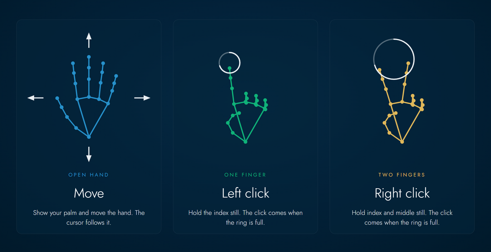

# Leviate

[](https://github.com/vladpereverzyev/leviate/actions/workflows/build.yml)
[](https://github.com/vladpereverzyev/leviate/releases)
[](https://github.com/vladpereverzyev/leviate/releases)
[](LICENSE)

[](https://github.com/vladpereverzyev/leviate/blob/main/README.md)
[](https://github.com/vladpereverzyev/leviate/blob/main/README.it.md)
[](https://github.com/vladpereverzyev/leviate/blob/main/README.es.md)
[](https://github.com/vladpereverzyev/leviate/blob/main/README.fr.md)
[](https://github.com/vladpereverzyev/leviate/blob/main/README.de.md)

**Try it now: <https://vladpereverzyev.github.io/leviate/>**

Move 3D scans with your bare hands. Leviate is a web app that turns any webcam,
on a computer or a phone, into a hand controller for 3D models. Open a scan, raise
your hand in front of the camera and rotate, pan or zoom it without touching anything.

Everything runs in the browser on the CPU. No install, no server, no GPU required
and your files never leave your device.


## Features

- **Hand gestures**: open hand to rotate, fist to pan, thumb and index to zoom.
- **Any webcam**: built-in or USB cameras on a computer, front or rear camera on a phone.
- **Your phone as a webcam**: scan a QR code with an iPhone or Android phone and its
  camera streams to the computer. No app to install.
- **Camera output of your choice**: device, resolution (480p, 720p, 1080p), frame rate,
  front or rear facing and mirror. The panel shows what the camera really delivers.
- **Many 3D formats**: STL, PLY, OBJ, GLB, GLTF, 3MF, FBX, DAE, 3DS, AMF, VTK, PCD and XYZ.
- **Several scans at once**: files loaded together keep their original coordinates,
  so upper and lower arches or the parts of an assembly stay aligned.
- **Scans stay in color**: PLY vertex colors, PLY textures, OBJ vertex colors and
  OBJ with MTL and texture images.
- **Per object tools**: color, show or hide, remove.
- **Floating windows**: files and webcam live in separate windows you can move
  and fold. On a phone they stack under the header.
- **View tools**: front, top, left and right presets, wireframe, turntable,
  screenshot to PNG and fullscreen.
- **Rotate around any point**: middle click (or double click, double tap on a phone) a
  point of the model and every rotation turns around it. **Reset** goes back to the center.
- **Mouse and touch** still work next to the gestures.
- **Blender**: the Leviate for Blender add-on brings the same hand control inside
  Blender, with the webcam or your phone. Your hand moves the view or the selected objects.
- **Fully offline**: all libraries and the hand model are bundled in the repository.

## Gestures


The drawings show the 21 hand points that the app tracks and draws over the
webcam preview, in the same colors it uses for each gesture.

| Hand pose | Action |
| --- | --- |
| Open hand (four or five fingers out) | Move the hand to **rotate** the model |
| Fist | Move the hand to **pan** the model in space |
| Thumb and index out, other fingers closed | Spread the two fingers to **zoom in** and close them to **zoom out** |

The zoom measures the gap between thumb and index relative to the size of your
palm, so moving the hand closer to the camera does not zoom by itself. When you
switch from one pose to another the model does not jump, because every gesture
starts from where the previous one stopped.

The sensitivity of each gesture and the amount of smoothing can be tuned in the
**Gestures** section of the panel. Settings are remembered in the browser.

## Quick start

Open **<https://vladpereverzyev.github.io/leviate/>** in Chrome, Edge, Safari or Firefox,
load one or more 3D files and press **Start** in the Webcam window. That is all: no
install, no account. After the first visit everything the app needs is already in the
browser.

### On a phone

<table>
<tr>
<td width="220"></td>
<td valign="middle">

Open the same link on the phone and everything works there too:

- **Files**: pick scans from the Files app, iCloud Drive or Google Drive.
- **Gestures**: the front camera watches your hand while you look at the screen.
- **Windows**: Files and Webcam stack under the header and open one at a time.
  Tap a title to open or close it.
- **Touch**: drag with one finger to rotate, two fingers to pan, pinch to zoom.
- **Toolbar**: view presets and tools stay at the bottom, one tap away.

To use the phone only as a camera for a computer, see
[Use your phone as a webcam](#use-your-phone-as-a-webcam).

</td>
</tr>
</table>

### Run your own copy

Leviate is a static site, so any web server can host it. Browsers do not load
JavaScript modules or WebAssembly from `file://`, so serve the folder over HTTP:

```sh
git clone https://github.com/vladpereverzyev/leviate.git
cd leviate
python -m http.server 8000
```

Then open the address the server prints. Phones need an `https` address to open the
camera, so publish your copy on an HTTPS host such as GitHub Pages, Netlify or
Cloudflare Pages.

## Use your phone as a webcam

Any iPhone or Android phone can be the camera of Leviate running on a computer.
Nothing to install on either device.

<table>
<tr>
<td width="260"></td>
<td valign="middle">

1. On the computer open the **Webcam** window and press **Use phone**.
   A QR code appears in the preview.
2. Scan it with the phone camera. Leviate opens in Safari or Chrome on the phone.
3. Tap **Start camera** and allow the camera. It starts with the front camera;
   **Flip** switches to the rear one.
4. The phone video shows up in the Webcam window and the gestures work as with a
   normal webcam.

</td>
</tr>
</table>

Keep the phone page open while you use it. Press **Disconnect phone** on the computer to
end the session. **Stop** on the phone pauses it: the computer shows the same QR code
again and **Start camera** on the phone connects again, with no new scan. When the link is
lost and the computer shows a new code, **Scan QR code** on the phone page reads it right
there. Clicking the QR code copies the pairing link, handy when you want to send it to the
phone another way.

How it works: the two devices connect with WebRTC. The free [PeerJS](https://peerjs.com)
server only introduces them to each other and passes the connection details; the video goes
straight from the phone to the computer, encrypted. If both are on networks that block a
direct link, the video is relayed through a PeerJS TURN server, still encrypted. The QR code
always points to an `https` page, because a phone can open the camera only there. A copy
running on your own computer pairs through <https://vladpereverzyev.github.io/leviate/>.

## Use it in Blender

**Leviate for Blender** brings the hand control inside Blender: the webcam and the hand
tracking run in Blender itself, no browser needed.

1. Download the zip for your system from the [latest release](https://github.com/vladpereverzyev/leviate/releases/latest):
   `leviate-blender-<version>-windows-x64.zip`, `-macos-arm64.zip` or `-linux-x64.zip`.
   Drag it into Blender 4.2 or later.
2. In the 3D view press **N** and open the **Leviate** tab. Choose **This computer** for
   the webcam or **Phone**, then press **Start camera**. With **Phone** a QR code appears:
   scan it and tap **Start camera** on the phone, no app needed.
3. Open hand rotates, fist pans, pinch zooms. **Move** chooses the view or the selected
   objects.

A small camera preview with the hand points appears in the corner of the 3D view. The
video is never recorded: the webcam stays in Blender, the phone sends its video straight
to Blender. Full guide in
[integrations/blender](integrations/blender/).

## Leviate desktop

**Leviate desktop** puts the hand on any program of the computer, with the webcam or the
phone (QR code, like the web app). It has two modules:

- **3D**: the gestures of the web app in your 3D program. Open hand turns, fist pans, pinch
  zooms the view under the cursor. Choose how that program uses the mouse (*Right turns ·
  Left+right pans* by default, used by dental CAD programs, or for example *Middle turns ·
  Shift+middle pans* for Blender) or set the buttons yourself.
- **Mouse**: open hand moves the cursor, one finger held still is a left click, two
  fingers held still a right click.



Download it from the [latest release](https://github.com/vladpereverzyev/leviate/releases/latest): `leviate-<version>-windows-x64.exe`,
`-macos-arm64.dmg` (Apple silicon), `-macos-x64.dmg` (Intel) or `-linux-x64.AppImage`.
Full guide in [apps/desktop](apps/desktop/).

## Supported files

| Format | Colors | Notes |
| --- | --- | --- |
| STL | single color you choose | normals are rebuilt on load |
| PLY | vertex colors or texture | for a texture, load the image with the PLY (`comment TextureFile` in the header); PLY without faces is shown as a point cloud |
| OBJ | vertex colors or MTL with textures | load the `.obj` together with its `.mtl` and image files |
| GLB, GLTF | own materials and textures | Draco and meshoptimizer compression supported; for `.gltf` add its `.bin` and images |
| 3MF | own colors | |
| FBX, DAE, 3DS | own materials and textures | add the texture images with the file |
| AMF | own colors | |
| VTK, VTP | vertex colors | |
| PCD, XYZ | point colors | shown as point clouds |

Select or drop all the files of a scan at the same time. If a texture or a companion
file is missing the app tells you which one.

## How it works

1. **Camera**: `getUserMedia` opens the selected webcam with the requested
   resolution and frame rate.
2. **Hand tracking**: [MediaPipe Hand Landmarker](https://ai.google.dev/edge/mediapipe/solutions/vision/hand_landmarker)
   runs as WebAssembly with the CPU delegate (XNNPACK) and returns 21 landmarks of
   the hand for every new video frame. It runs in a Web Worker (`js/hand-worker.js`),
   so the 3D view never waits for it; browsers without module workers fall back to
   the main thread.
3. **Pose**: `js/gestures.js` checks which fingers are extended by comparing the
   direction of each fingertip with the direction of the palm and turns that into
   one of three poses. A pose must be stable for a few frames before it becomes
   active, which removes flicker.
4. **Motion**: the palm center is smoothed and its movement between frames becomes
   rotation or pan. For zoom the ratio between the thumb to index gap and the palm
   size is tracked over time.
5. **Rendering**: [three.js](https://threejs.org) draws the scans with WebGL.
   Rotation follows the screen axes of the camera, so moving the hand right always
   turns the model right whatever the current view is.

## Project structure

| Path | Purpose |
| --- | --- |
| `index.html` | Layout: stage, objects, webcam, gestures and view panels |
| `css/style.css` | Desktop and mobile styles |
| `js/app.js` | Scene, file loading, camera, tracking loop and UI |
| `js/gestures.js` | Hand pose classification and motion (no DOM, easy to test) |
| `js/version.js` | Current version, shown in the app |
| `scripts/bump.mjs` | Raises the version (patch, minor or major) |
| `js/hand-worker.js` | Hand tracking in a Web Worker, off the main thread |
| `js/phone.js` | Phone as webcam: QR pairing on the computer, camera page on the phone |
| `js/windows.js` | Floating windows: drag, collapse, phone layout |
| `integrations/` | Add-ons that bring the hand control inside other programs (Blender) |
| `scripts/build-blender.py` | Packs the Blender add-on into a zip |
| `apps/desktop/` | Leviate desktop (Electron): the hand on any program, 3D and Mouse modules |
| `scripts/build-desktop.mjs` | Builds the desktop app for Windows, macOS or Linux |
| `vendor/three/` | three.js, its loaders and decoders (MIT, Draco Apache-2.0) |
| `vendor/peerjs/`, `vendor/qrcode/` | WebRTC pairing and QR code generator (MIT) |
| `vendor/fonts/` | Jost font (SIL OFL 1.1) |
| `docs/` | Screenshots, QR window and gesture drawings used in this README |
| `icons/`, `site.webmanifest` | App icons for browsers, iOS and Android |
| `vendor/mediapipe/` | MediaPipe Tasks Vision and its WebAssembly runtime (Apache-2.0) |
| `models/hand_landmarker.task` | MediaPipe hand model (Apache-2.0) |

## Versions

The version is shown next to the name in the app and lives in `js/version.js`.
It follows [semantic versioning](https://semver.org) and grows with every commit:
the pre-commit hook in `.githooks/` raises the patch number automatically.
Enable it once after cloning:

```sh
git config core.hooksPath .githooks
```

For a minor or major release run `node scripts/bump.mjs minor` (or `major`) before
committing. A tag `v<version>` starts the Build & Release workflow: it builds the
integration zips and publishes them as a new release on the
[releases page](https://github.com/vladpereverzyev/leviate/releases). The web app is not
in the release, it always runs from the link at the top.

## Not a medical device

Leviate is a 3D viewer. It is not a medical device and it is not meant for diagnosis,
treatment planning or any other clinical decision. Always check scans in the software
approved for that purpose.

## Privacy

The video stream and your scans are processed only inside your browser. Nothing is
uploaded, there is no tracking and no account. The only outside service is the PeerJS
broker used by **Use phone**, which sees the connection details but never the video.

## Contributing

Issues and pull requests are welcome. Please read [CONTRIBUTING.md](CONTRIBUTING.md)
and the [Code of Conduct](CODE_OF_CONDUCT.md)
first. Every contribution needs the [Contributor License Agreement](CLA.md): the CLA
Assistant bot asks you to sign it with one comment on your first pull request.

### Bring Leviate to your CAD

Integrations for other CAD and 3D programs are the most welcome contribution: FreeCAD,
Rhino, Fusion, SolidWorks, Inventor, SketchUp, dental CAD software with an open API and
any program that can be scripted. Blender shows the way. The policy for integrations:

1. One folder per program in `integrations/<program>/` with source, README and LICENSE.
2. The same gestures everywhere: reuse the hand tracking of Leviate for Blender
   (`gestures.py` and the MediaPipe model), see [integrations/README.md](integrations/README.md).
3. Local only: the camera is read on the computer, nothing is recorded or sent, no telemetry.
4. Light: use the program's own scripting and add-on system, avoid extra installs.
5. License: what the program asks for (Blender add-ons are GPL-3.0-or-later), otherwise
   AGPL-3.0. The CLA applies.
6. Name: "Leviate for <Program>", not made or endorsed by the program's owner.
7. Each integration is built as a zip by the Build & Release workflow and attached to the
   release.

## Support

If Leviate is useful to you, you can support its development on
[GitHub Sponsors](https://github.com/sponsors/vladpereverzyev) or
[Ko-fi](https://ko-fi.com/vladpereverzyev).

## License

Copyright (C) 2026 Vladyslav Pereverzyev

Leviate is dual licensed.

- **Open source**: [GNU Affero General Public License v3.0](LICENSE). You can use,
  study, modify and share it for free. If you distribute a modified version or offer
  it to users over a network you must publish your source code under the same license.
- **Commercial**: if you want to include Leviate in a closed source product or a
  service without the AGPL obligations, a commercial license is available. Open an
  issue titled "Commercial license" or contact
  [@vladpereverzyev](https://github.com/vladpereverzyev) on GitHub.

The name "Leviate" and its logo are not covered by the AGPL-3.0 and may not be used
for modified versions without permission.

The integrations in `integrations/` carry their own license file. Leviate for Blender is
GPL-3.0-or-later, as Blender asks for its add-ons.

Third-party components keep their own licenses. See [NOTICE](NOTICE) and
[THIRD-PARTY-NOTICES.md](THIRD-PARTY-NOTICES.md).
