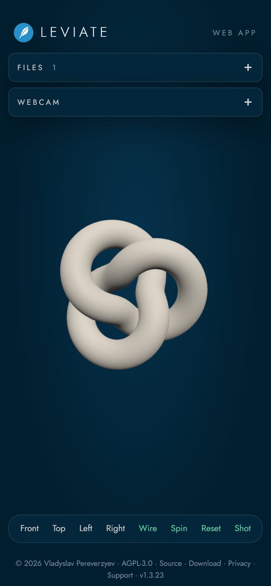
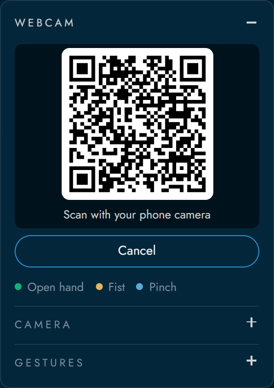

# Leviate guide

How to use the web app of Leviate, your phone as a webcam and the files it opens. For the
other parts see [Leviate for Desktop](../desktop/), [Leviate for Blender](../integrations/blender/),
[Leviate for Chrome](../integrations/chrome-extension/) and
[Leviate for Dentra Viewer](../integrations/dentra/).

## Features

- **Hand gestures**: open hand to rotate, fist to pan, thumb and index to zoom.
- **Medical and work gloves**: the hand is found with nitrile or latex gloves too, blue,
  purple and black included, and with work gloves. Nothing to turn on.
- **Any webcam**: built-in or USB cameras on a computer, front or rear camera on a phone.
- **Your phone as a webcam**: scan a QR code with an iPhone or Android phone and its
  camera streams to the computer. No app to install.
- **Camera output of your choice**: device, resolution (480p, 720p, 1080p), frame rate,
  front or rear facing and mirror. The panel shows what the camera really delivers.
- **Many 3D formats**: STL, PLY, OBJ, GLB, GLTF, 3MF, FBX, DAE, 3DS, AMF, VTK, PCD and XYZ.
- **Several scans at once**: files loaded together keep their original coordinates,
  so upper and lower arches or the parts of an assembly stay aligned.
- **Scans stay in color**: PLY vertex colors, PLY textures, OBJ vertex colors and
  OBJ with MTL and texture images.
- **Per object tools**: color, show or hide, remove.
- **Floating windows**: files and webcam live in separate windows you can move
  and fold. On a phone they stack under the header.
- **View tools**: front, top, left and right presets, wireframe, turntable,
  screenshot to PNG and fullscreen.
- **Rotate around any point**: middle click (or double click, double tap on a phone) a
  point of the model and every rotation turns around it. **Reset** goes back to the center.
- **Mouse and touch** still work next to the gestures.
- **Fully offline**: all libraries and the hand model are bundled in the repository.

## Gestures

The drawings show the 21 hand points that the app tracks and draws over the
webcam preview, in the same colors it uses for each gesture.

| Hand pose | Action |
| --- | --- |
| Open hand (four or five fingers out) | Move the hand to **rotate** the model |
| Fist | Move the hand to **pan** the model in space |
| Thumb and index out, other fingers closed | Spread the two fingers to **zoom in** and close them to **zoom out** |

The zoom measures the gap between thumb and index relative to the size of your
palm, so moving the hand closer to the camera does not zoom by itself. When you
switch from one pose to another the model does not jump, because every gesture
starts from where the previous one stopped.

The sensitivity of each gesture and the amount of smoothing can be tuned in the
**Gestures** section of the panel. Settings are remembered in the browser.

## On a phone

<table>
<tr>
<td width="220"></td>
<td valign="middle">

Open <https://vladpereverzyev.github.io/leviate/> on the phone and everything works there too:

- **Files**: pick scans from the Files app, iCloud Drive or Google Drive.
- **Gestures**: the front camera watches your hand while you look at the screen.
- **Windows**: Files and Webcam stack under the header and open one at a time.
  Tap a title to open or close it.
- **Touch**: drag with one finger to rotate, two fingers to pan, pinch to zoom.
- **Toolbar**: view presets and tools stay at the bottom, one tap away.

</td>
</tr>
</table>

## Use your phone as a webcam

Any iPhone or Android phone can be the camera of Leviate running on a computer.
Nothing to install on either device. Connect the phone and the computer to the same
Wi-Fi network.

<table>
<tr>
<td width="260"></td>
<td valign="middle">

1. On the computer open the **Webcam** window and press **Use phone**.
   A QR code appears in the preview.
2. Scan it with the phone camera. Leviate opens in Safari or Chrome on the phone.
3. Tap **Start camera** and allow the camera. It starts with the front camera;
   **Flip** switches to the rear one.
4. The phone video shows up in the Webcam window and the gestures work as with a
   normal webcam.

</td>
</tr>
</table>

Keep the phone page open while you use it. Press **Disconnect phone** on the computer to
end the session. **Stop** on the phone pauses it: the computer shows the same QR code
again and **Start camera** on the phone connects again, with no new scan. When the link is
lost and the computer shows a new code, **Scan QR code** on the phone page reads it right
there. Clicking the QR code copies the pairing link, handy when you want to send it to the
phone another way.

How it works: the two devices connect with WebRTC. The free [PeerJS](https://peerjs.com)
server only introduces them to each other and passes the connection details; the video goes
straight from the phone to the computer, encrypted. If both are on networks that block a
direct link, the video is relayed through a PeerJS TURN server, still encrypted. The QR code
always points to an `https` page, because a phone can open the camera only there. A copy
running on your own computer pairs through <https://vladpereverzyev.github.io/leviate/>.

## Supported files

| Format | Colors | Notes |
| --- | --- | --- |
| STL | single color you choose | normals are rebuilt on load |
| PLY | vertex colors or texture | for a texture, load the image with the PLY (`comment TextureFile` in the header); PLY without faces is shown as a point cloud |
| OBJ | vertex colors or MTL with textures | load the `.obj` together with its `.mtl` and image files |
| GLB, GLTF | own materials and textures | Draco and meshoptimizer compression supported; for `.gltf` add its `.bin` and images |
| 3MF | own colors | |
| FBX, DAE, 3DS | own materials and textures | add the texture images with the file |
| AMF | own colors | |
| VTK, VTP | vertex colors | |
| PCD, XYZ | point colors | shown as point clouds |

Select or drop all the files of a scan at the same time. If a texture or a companion
file is missing the app tells you which one.
